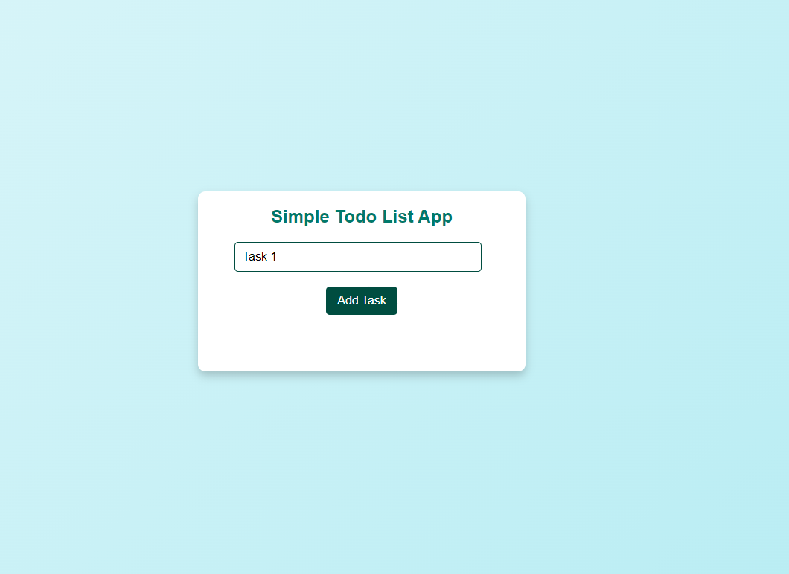
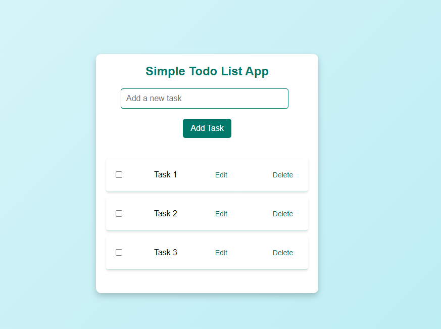
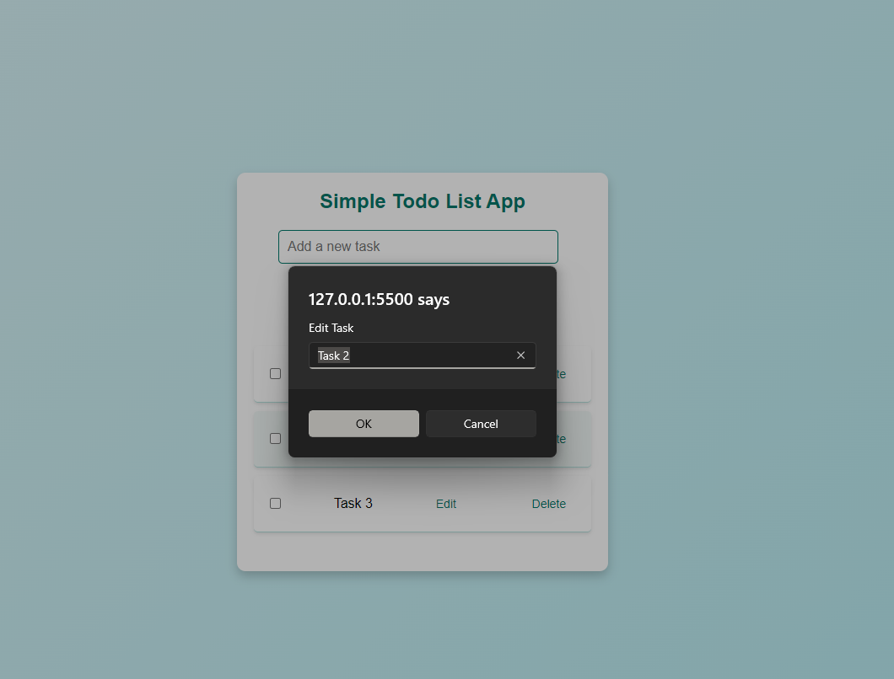
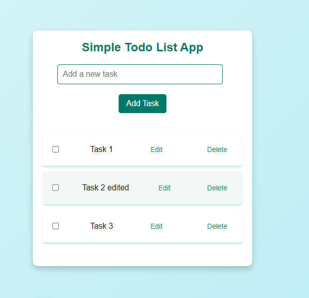
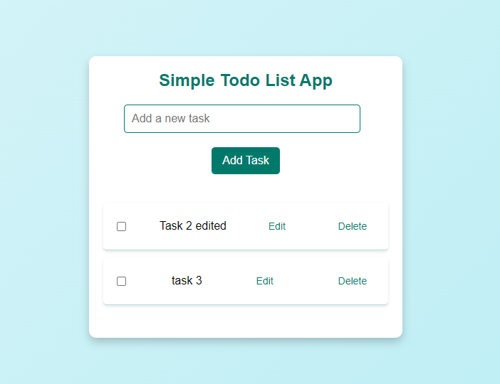
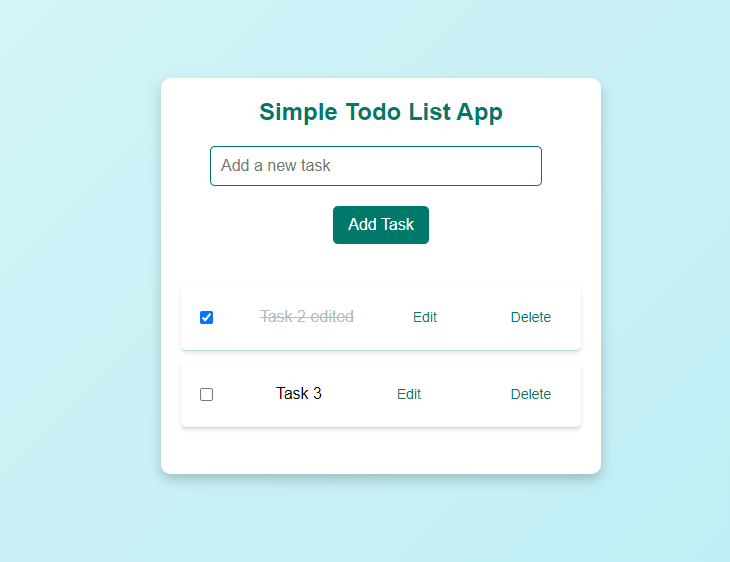

# Task Manager App

Overview
The Task Manager App is a simple web-based application designed to help users manage their to-do tasks. It provides functionalities to add, edit, delete, and mark tasks as complete. This app allows for easy task management with a minimalistic interface.

## Features

Add Task: Users can add a new task to the list by entering text and clicking the "Add" button.
Edit Task: Each task can be edited by clicking the "Edit" button next to it. Users can change the task text and save the updated value.
Delete Task: Users can remove tasks from the list by clicking the "Delete" button.
Toggle Completion: Users can mark tasks as complete or incomplete by checking/unchecking the checkbox next to each task.
Usage

### Add a Task

Enter your task in the input field.
Click the "Add" button to add the task to the list.

### Edit a Task

Click the "Edit" button next to the task you want to change.
Enter the new task text in the prompt that appears and click "OK".

### Delete a Task

Click the "Delete" button next to the task you want to remove.

### Toggle Completion

Click the checkbox next to the task to mark it as complete or incomplete. The task text will be visually updated to reflect its status.

# Getting Started with Create React App

This project was bootstrapped with Create React App.

## Available Scripts

In the project directory, you can run:

## npm start

Runs the app in the development mode.
Open <http://localhost:3000> to view it in your browser.

The page will reload when you make changes.
You may also see any lint errors in the console.

## npm test

Launches the test runner in the interactive watch mode.
See the section about running tests for more information.

## npm run build

Builds the app for production to the build folder.
It correctly bundles React in production mode and optimizes the build for the best performance.

The build is minified and the filenames include the hashes.
Your app is ready to be deployed!

See the section about deployment for more information.

## npm run eject

Note: this is a one-way operation. Once you eject, you can't go back!

If you aren't satisfied with the build tool and configuration choices, you can eject at any time. This command will remove the single build dependency from your project.

Instead, it will copy all the configuration files and the transitive dependencies (webpack, Babel, ESLint, etc) right into your project so you have full control over them. All of the commands except eject will still work, but they will point to the copied scripts so you can tweak them. At this point you're on your own.

You don't have to ever use eject. The curated feature set is suitable for small and middle deployments, and you shouldn't feel obligated to use this feature. However we understand that this tool wouldn't be useful if you couldn't customize it when you are ready for it.
